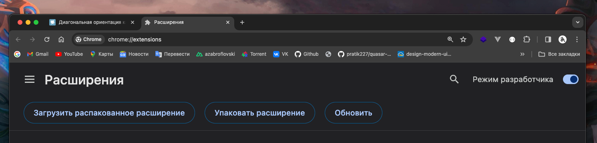
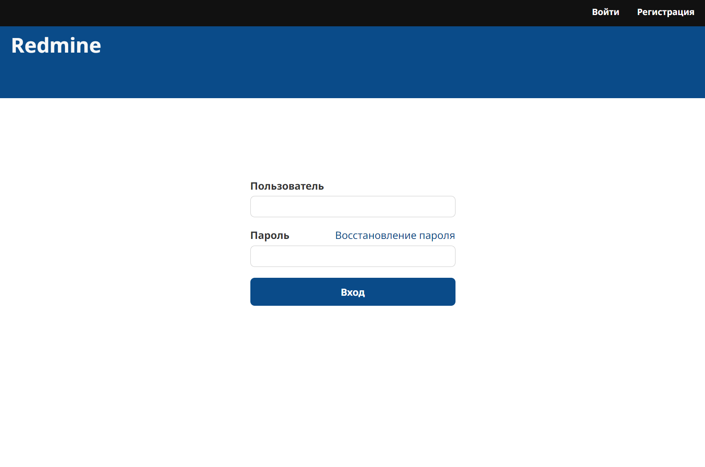
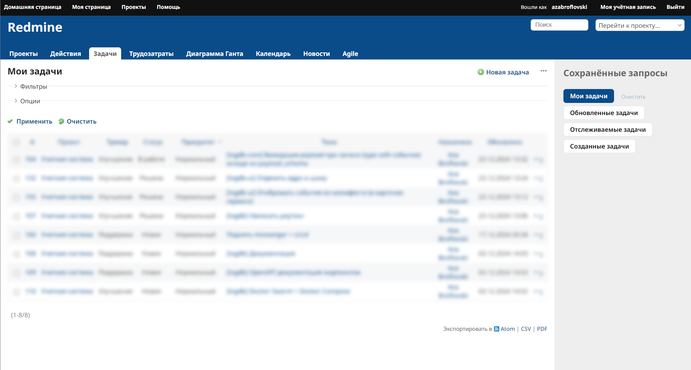
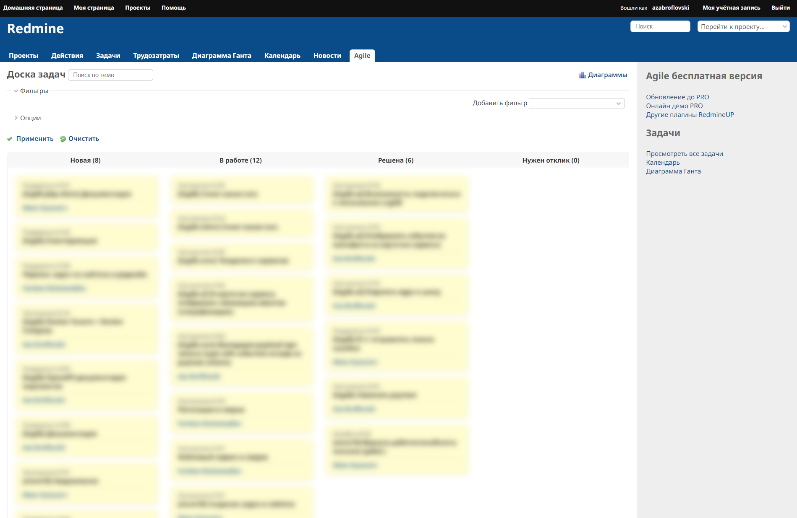

# redmine-zoomer-extenion

## Why ?
Вы зумер? если нет, скипните и уходите отсюда.

Решение для тех, кто устал от унылого интерфейса Redmine и готов делать свой рабочий процесс хотя бы визуально приятным.

Если вам надоело, что каждый клик вызывает у вас приступ депрессии, это расширение — ваш шанс на спасение. Применяйте его и забудьте про серые страницы, как про прошлое. Это для тех, кто верит, что даже в Redmine можно сделать что-то красивое, если не бояться рисковать

## Установка

1. Скачайте и распакуйте расширение:
   - [Нажмите сюда](https://github.com/azabroflovski/diagonal-orientation-extension/raw/master/extension.zip) чтобы скачать архив `extension.zip`
   - Распакуйте скачанный архив в удобную для вас папку.

2. Установите расширение:
   - Откройте Chrome и перейдите в меню `Еще > Дополнительные инструменты > Расширения`
   - Включите режим разработчика, переключив тумблер в правом верхнем углу
   - Нажмите кнопку `Загрузить распакованное расширение`
   - Выберите папку, куда вы распаковали исходники расширения

3. Готово! 

Расширение установлено и готово к работе.

## Demo 

Home page 

Tasks page 

Agile board 

## LICENSE
MIT 
